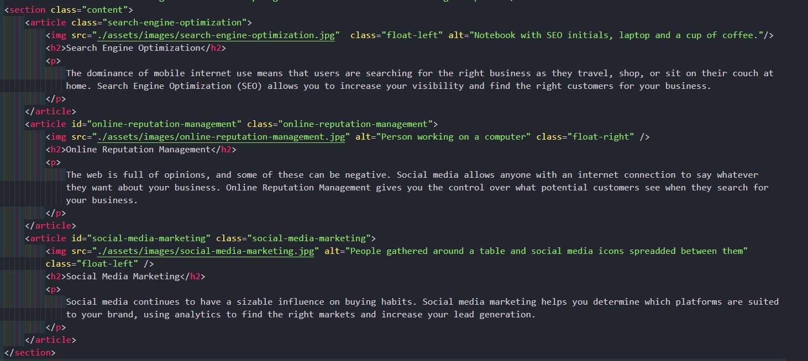

# Horiseon

## Description
The Horiseon website aims to offer services to improve and optimize websites content to make them easier to find when customers searching online and achieve better accessibility for all users. This website was created by using semantic HTML and CSS.  


## Link

Horiseon website link [Horiseon](https://kodeiva.github.io/Horiseon/).

## Installation

N/A

## Usage

* Semantic elements used:

```html
<header> <section> <aside> <footer>
 ```

* HTML

Some of the HTML elements have been replaced with semantic elements for better website accessibility:





* CSS 


## Credits

N/A


## License
[MIT](https://choosealicense.com/licenses/mit/)


